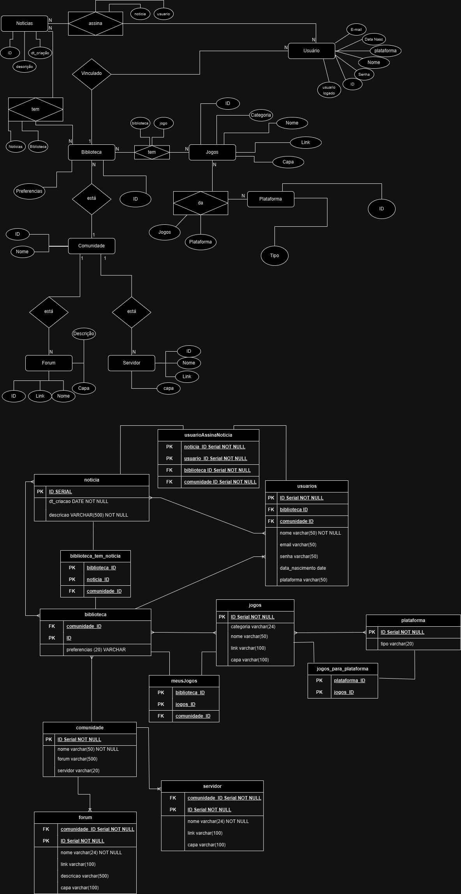

# Proz Arts

Este é um projeto simples com o objetivo de usar todo o conhecimento obtido pelos alunos no curso Talentos Cloud envolvendo a triade da web: HTML, CSS e JavaScript e comandos com git e git flow.

## contribuidores

1. Francisco Cosme - desenvolvedor
2. Jefferson - desenvolvedor
3. Vanderson - desenvolvedor
4. Villas - desenvolvedor

## Ambiente de execução

**Requisitos:** Ter, no mínimo, um browser instalado, como mozila, microsoft edge, google chrome, etc.

## Sobre a aplicação

### Estrutura do projeto

  - componentes: código que poderá ser usado ou chamado em mais de uma parte do site
    - htmls: estrutura de um componente,
    - load: carregar dados externos e internos no projeto, seja o dado estilos ou código (como a estrutura do html mencionada anteriormente)
    - style: contém estilos que poderá ser usado ou chamado em mais de uma parte do site
    - funcoesGlobais: todas as funções que poderam ser chamadas em qualquer arquivo js afim diminuir códigos repetidos. Vale ressaltar que quanto mais genérico for as funções, melhor.
  - images: contém todas as imagens usadas no site
  - pages: contém uma lista de diretórios, sendo cada um armazenando a estrutura e estilização própria e independente.
  - index.html e style.css: respectivamente a estrutura e estilização da página inicial (Home)

### Modelagem do Banco de Dados do projeto Completo

Logo a seguir será mostrado o DER, Diagrama de Entidade e Relacionamento, e MER, Modelo de Entidade e Relacionamento, do projeto da ProzArts que incluí a lógica de quando o usuário loga com sucesso, embora não tenha sido implementado por conter muitas funcionalidades além das que foram solicitadas.

