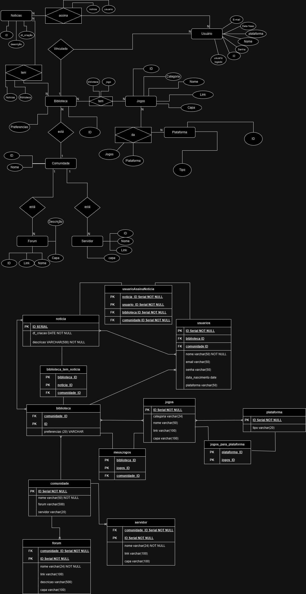

# Proz Arts

Este é um projeto simples com o objetivo de usar todo o conhecimento obtido pelos alunos no curso Talentos Cloud envolvendo a triade da web: HTML, CSS e JavaScript e comandos com git e git flow.

## contribuidores

1. Francisco Cosme - desenvolvedor
2. Jefferson - desenvolvedor
3. Vanderson - desenvolvedor
4. Villas - desenvolvedor

## Ambiente de execução

**Requisitos:** Ter, no mínimo, um browser instalado, como mozila, microsoft edge, google chrome, etc.

## Sobre a aplicação

### sprints

As seguintes Sprints foram exigidas para que os integrantes consigam consumir todos os conteúdos do curso.

#### Sprint I - Planejamento

1. Desenvolver o layout de pelo menos 5 páginas no site;
2. Apresentar as funcionalidades definidas pelas regras de negócio do tema proposto.

**Ferramentas usadas: ** [figma](https://www.figma.com/).

#### Sprint II - HTML

1. Organizar o conteúdo do site usando apenas o HTML;
2. Ter pelo menos 5 arquivos HTML (um para cada layout criado na Sprint I);
3. Configurar o repositório remoto para a equipe.

**Ferramentas usadas: ** [GitHub](https://github.com/) e [VSCode](https://code.visualstudio.com/).

#### Sprint III - CSS

1. Estilize as 5 páginas criadas anteriormente em HTML;
2. Implementar um design com a manipulação do modelo de caixa dos elementos, além de tamanhos e cores das fontes;
3. Tente implementar o uso de  flex-box em ao menos uma das telas.

**Ferramentas usadas: ** [GitHub](https://github.com/) e [VSCode](https://code.visualstudio.com/).

#### Sprint IV - JS

1. Manipular o DOM via JS;
2. Validar os campos de todos os formulários;
3. Renderizar dinamicamente os elementos em pelo menos um página.

**Ferramentas usadas: ** [GitHub](https://github.com/) e [VSCode](https://code.visualstudio.com/).

#### Sprint V - Banco de Dados

1. Modelar o Diagrama de Entidade de Relacionamento do sistema de login;
2. Criar o Banco de Dados com informações de teste;
3. Realizar consultas simples, idealmente juntando tabelas.

**Ferramentas usadas: ** [draw.io](https://www.drawio.com/) e [sqliteonline.com](https://sqliteonline.com/).

### Estrutura do projeto

  - componentes: código que poderá ser usado ou chamado em mais de uma parte do site
    - htmls: estrutura de um componente,
    - load: carregar dados externos e internos no projeto, seja o dado estilos ou código (como a estrutura do html mencionada anteriormente)
    - style: contém estilos que poderá ser usado ou chamado em mais de uma parte do site
    - funcoesGlobais: todas as funções que poderam ser chamadas em qualquer arquivo js afim diminuir códigos repetidos. Vale ressaltar que quanto mais genérico for as funções, melhor.
  - images: contém todas as imagens usadas no site
  - pages: contém uma lista de diretórios, sendo cada um armazenando a estrutura e estilização própria e independente.
  - index.html e style.css: respectivamente a estrutura e estilização da página inicial (Home)

### Modelagem do Banco de Dados do projeto Completo

Logo a seguir será mostrado o DER, Diagrama de Entidade e Relacionamento, e MER, Modelo de Entidade e Relacionamento, do projeto da ProzArts que incluí a lógica de quando o usuário loga com sucesso, embora não tenha sido implementado por conter muitas funcionalidades além das que foram solicitadas.

O código DDL, Data Definition Language, do projeto pode ser visto no arquivo `DDL - Proz Arts.sql` no diretório `./docs/bd/`.